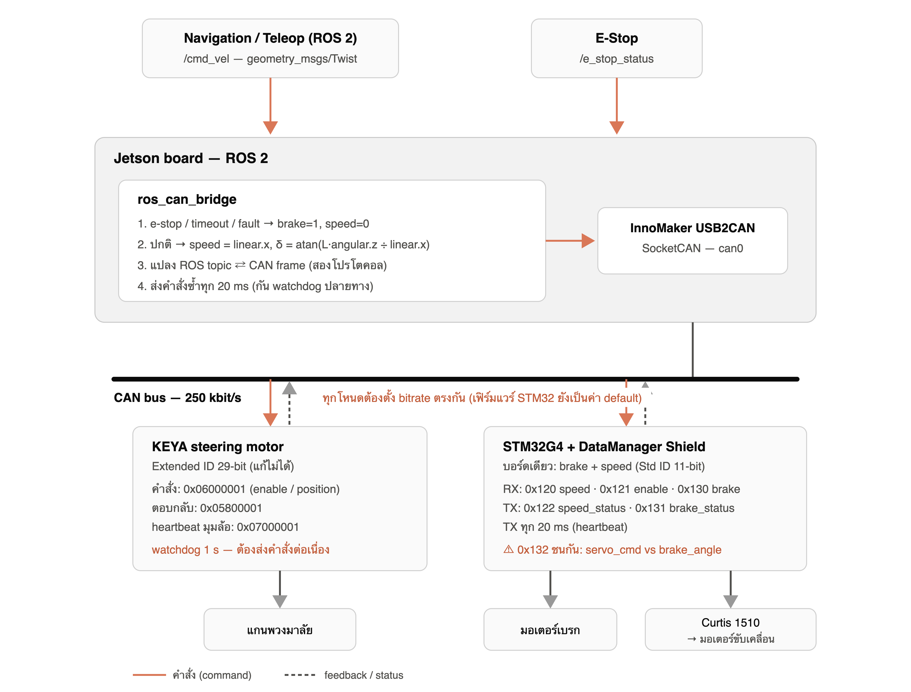

# Golf Cart Low-Level Control

ROS 2 and STM32 firmware for a drive-by-wire golf cart low-level control layer.

The Jetson Orin Nano runs the ROS 2 nodes and talks to the vehicle CAN bus through
an InnoMaker USB2CAN adapter. The STM32G4 car-shield firmware in this repository
controls the brake and Curtis 1510 speed interface. The KEYA steering motor is
driven directly from ROS 2 over extended CAN frames.



## Repository Layout

```text
.
├── ros2_ws/
│   └── src/golfcart_low_level/        # Jetson ROS 2 package
├── firmware/
│   └── stm32_motorbrake_car_shield/   # STM32CubeIDE brake + speed firmware
└── docs/
    └── golfcart_low_level_control_overview.png
```

## System Architecture

```text
Navigation / Teleop
  /cmd_vel
     |
Jetson Orin Nano
  golfcart_low_level
  - ros_can_bridge
  - steering_node
     |
InnoMaker USB2CAN, SocketCAN can0, 250 kbit/s
     |
CAN bus
  - STM32G4 brake + speed board, standard 11-bit IDs
  - KEYA steering motor, extended 29-bit IDs
```

Normal driving commands go through `/cmd_vel`. A separate `/brake_cmd` topic is
provided for manual brake bench tests and hardware checkout.

- `cmd_vel.linear.x` is target speed in m/s.
- `cmd_vel.angular.z` is yaw rate in rad/s.
- `/brake_cmd` (`std_msgs/msg/Bool`) is a manual brake override:
  `true = brake`, `false = return to /cmd_vel control`.
- `ros_can_bridge` converts yaw rate to steering angle with a bicycle model.
- `ros_can_bridge` owns speed/brake safety logic.
- `steering_node` owns KEYA motor command, heartbeat, timeout, and steering fault handling.
- By default, `steering_node` does not enable the KEYA motor at startup. It waits
  until `/steering_cmd` is fresh and `/lowlevel_fault` + `/e_stop_status` are clear.

## CAN Protocol

The protocol below matches `firmware/stm32_motorbrake_car_shield`, synced from
`Downloads/GolfCart/Speed control/AJYui_MotorBrakeModule-Dev_dataloggerShield`.
The bus is classic CAN, standard 11-bit IDs for STM32 frames, 250 kbit/s, so it
can share the same physical bus with the KEYA steering motor.

| CAN ID | Direction | DLC | Meaning |
|---|---|---:|---|
| `0x120` | Jetson to STM32 | 2 | target speed, `int16` little-endian, scale `0.01 m/s` |
| `0x121` | Jetson to STM32 | 1 | speed enable, byte0 `0/1` |
| `0x122` | STM32 to Jetson | 8 | speed status: measured/target speed, flags, fault code, sequence |
| `0x123` | STM32 to Jetson | 8 | speed diagnostics: Curtis I/O flags, MCOR mV, speed sensor Hz |
| `0x130` | Jetson to STM32 | 1 | brake command, byte0 `0 = release`, `1 = brake` |
| `0x131` | STM32 to Jetson | 8 | brake status heartbeat |
| `0x132` | Jetson to STM32 | 8 | servo command: `float32 start_deg`, `float32 stop_deg` |
| `0x133` | STM32 to Jetson | 8 | servo status: `float32 start_deg`, `float32 stop_deg` |
| `0x134` | STM32 to Jetson | 1 | current brake servo target angle in whole degrees |

`0x131` payload:

| Byte | Meaning |
|---|---|
| `0..3` | brake current in mA, `float32` little-endian |
| `4` | relay active |
| `5` | status bits: bit0 watchdog/fault latch, bit1 PC13 e-stop live |
| `6..7` | sequence counter, `uint16` little-endian |

`0x122` payload:

| Byte | Meaning |
|---|---|
| `0..1` | measured speed, `int16` little-endian, scale `0.01 m/s` |
| `2..3` | target speed, `int16` little-endian, scale `0.01 m/s` |
| `4` | status flags: bit0 enabled, bit1 fwd, bit2 rev, bit3 pedal, bit4 sensor valid, bit5 timeout, bit6 e-stop, bit7 fault |
| `5` | fault code |
| `6..7` | sequence counter, `uint16` little-endian |

`0x123` payload:

| Byte | Meaning |
|---|---|
| `0` | input flags: bit0 FWD, bit1 REV, bit2 Pedal |
| `1` | output flags: bit0 FWD, bit1 REV, bit2 Pedal, bit3 mode relay |
| `2..3` | MCOR input in mV, `uint16` little-endian |
| `4..5` | MCOR output in mV, `uint16` little-endian |
| `6..7` | speed sensor Hz, `uint16` little-endian |

KEYA steering uses extended CAN IDs:

| CAN ID | Direction | Meaning |
|---|---|---|
| `0x06000001` | Jetson to KEYA | enable / disable / position command |
| `0x05800001` | KEYA to Jetson | response |
| `0x07000001` | KEYA to Jetson | heartbeat |

## Jetson Orin Nano Setup

Install ROS 2 and CAN tools first. Then install project dependencies:

```bash
sudo apt update
sudo apt install -y can-utils python3-aenum python3-can python3-colcon-common-extensions
sudo apt install -y ros-$ROS_DISTRO-geometry-msgs ros-$ROS_DISTRO-std-msgs
```

Build the ROS 2 package:

```bash
cd ~/GolfCart/golfcart-low-level-control/ros2_ws
source /opt/ros/$ROS_DISTRO/setup.bash
colcon build --symlink-install
source install/setup.bash
```

Optional shell setup:

```bash
echo "source /opt/ros/$ROS_DISTRO/setup.bash" >> ~/.bashrc
echo "source ~/GolfCart/golfcart-low-level-control/ros2_ws/install/setup.bash" >> ~/.bashrc
```

## CAN Bring-Up

Connect the InnoMaker USB2CAN adapter and verify that `can0` exists:

```bash
ip link
```

Bring up the CAN interface at 250 kbit/s:

```bash
cd ~/GolfCart/golfcart-low-level-control/ros2_ws
bash src/golfcart_low_level/scripts/setup_can0.sh can0 250000
```

Or manually:

```bash
sudo ip link set can0 down
sudo ip link set can0 up type can bitrate 250000 restart-ms 100
ip -details -statistics link show can0
```

Check raw CAN traffic:

```bash
candump can0
```

Expected CAN heartbeat/status frames:

```text
can0  131   [8]  ...
can0  122   [8]  ...
can0  123   [8]  ...
can0  133   [8]  ...
can0  134   [1]  ...
```

## Run ROS 2 Low-Level Control

Launch both low-level nodes:

```bash
cd ~/GolfCart/golfcart-low-level-control/ros2_ws
source install/setup.bash
ros2 launch golfcart_low_level low_level.launch.py
```

Useful status topics:

```bash
ros2 topic echo /lowlevel_fault
ros2 topic echo /e_stop_status
ros2 topic echo /speed_status
ros2 topic echo /speed_target
ros2 topic echo /speed_diagnostics
ros2 topic echo /brake_status
ros2 topic echo /brake_angle
ros2 topic echo /steering_angle
ros2 topic echo /steering_fault
```

Send a stopped command first:

```bash
ros2 topic pub -r 10 /cmd_vel geometry_msgs/msg/Twist \
  "{linear: {x: 0.0}, angular: {z: 0.0}}"
```

Slow straight test, only when the vehicle is mechanically safe:

```bash
ros2 topic pub -r 10 /cmd_vel geometry_msgs/msg/Twist \
  "{linear: {x: 0.2}, angular: {z: 0.0}}"
```

## Brake Command Examples

`ros_can_bridge` normally commands the brake automatically from `/cmd_vel` and
safety state. For manual brake testing, use `/brake_cmd`:

```bash
ros2 topic pub --once /brake_cmd std_msgs/msg/Bool "{data: true}"
```

That sends this safe low-level command set every control loop:

```text
speed_enable = 0
target_speed = 0
brake_cmd = 1    # CAN 0x130 byte0 = 1
```

To release the manual brake override, keep a fresh stopped `/cmd_vel` publishing
and then send:

```bash
ros2 topic pub --once /brake_cmd std_msgs/msg/Bool "{data: false}"
```

With the default `brake_on_zero_cmd: false`, a fresh zero `/cmd_vel` releases the
brake after `/brake_cmd` is false. If `brake_on_zero_cmd: true`, zero `/cmd_vel`
keeps the brake engaged.

Watch feedback while testing:

```bash
ros2 topic echo /brake_status
ros2 topic echo /brake_current
ros2 topic echo /brake_angle
candump can0,130:7FF,131:7FF,134:7FF
```

More step-by-step brake test examples are in
[`docs/brake_control_examples.md`](docs/brake_control_examples.md).

## STM32 Firmware

Open this STM32CubeIDE firmware project:

```text
firmware/stm32_motorbrake_car_shield
```

Important FDCAN settings:

```text
FDCAN clock: 170 MHz
NominalPrescaler: 40
NominalTimeSeg1: 13
NominalTimeSeg2: 3
NominalSyncJumpWidth: 3
Nominal bitrate: 250 kbit/s
Sample point: 82.4%
StdFiltersNbr: 4
```

`StdFiltersNbr` is overridden to `4` in `CAN_App_Init()` because the firmware
accepts `0x130`, `0x132`, `0x120`, and `0x121`. The bit timing itself comes from
the `.ioc`: `NominalPrescaler=40`, `NominalTimeSeg1=13`,
`NominalTimeSeg2=3`, `NominalSyncJumpWidth=3`.

E-stop behavior:

```text
PD2 active-low, falling edge latches watchdog_status = 1
PD2 is sampled at boot; if already LOW, watchdog_status is latched immediately
PD2 is re-initialized with an internal pull-up in USER CODE
PC13 E_Stop is active-low, input pull-up, and reported live in 0x131 bit1 and 0x122 bit6
ROS /e_stop_status follows the real CAN status bits; startup safety is handled by heartbeat timeout, not by forcing e-stop true.
```

Wire the real e-stop so the idle/safe state leaves the input HIGH and an active
e-stop pulls the input LOW. PD2 is latched in `watchdog_status`; PC13 is a live
non-latching e-stop input that engages the brake and zeros the speed target
while active.

Build and flash the STM32 board from STM32CubeIDE. After flashing, the board
should publish the brake group (`0x131`, `0x133`, `0x134`) and speed group
(`0x122`, `0x123`) periodically.

## Safety Behavior

The bridge commands a safe state when any of these conditions is true:

- e-stop/fault byte from STM32 `0x131` is active
- speed timeout/fault flags from STM32 `0x122` are active
- `/cmd_vel` timeout
- STM32 heartbeat timeout

Safe state:

```text
speed_enable = 0
target_speed = 0
brake_cmd = 1
steering_node enters safe steering state
```

The e-stop must still be hardwired to the STM32 or vehicle safety circuit. The
Jetson/ROS layer is supervision and command arbitration, not the only safety path.

## Quick Troubleshooting

No `0x131` in `candump can0`:

- Confirm Jetson, STM32 brake/speed board, and KEYA steering are all at 250 kbit/s.
- Check CAN_H/CAN_L polarity.
- Check 120 ohm termination at both ends of the bus.
- Check CAN transceiver power and common ground/reference.
- Confirm the STM32 firmware flashed successfully.

`/lowlevel_fault` stays true:

- Confirm `candump can0` shows `0x131`.
- Confirm byte 5 of `0x131` is not reporting e-stop/fault.
- Confirm `/cmd_vel` is being published continuously.

Steering does not move:

- Confirm KEYA heartbeat `0x07000001` appears as an extended CAN frame.
- Confirm `steering_node` is running and `/steering_fault` is false.
- Confirm `/lowlevel_fault` and `/e_stop_status` are false before expecting steering motion.
- Confirm `/cmd_vel` is being published continuously; without a fresh command,
  `steering_node` keeps KEYA disabled in the default hardware-safe config.

## Notes

Do not run old standalone bridge scripts at the same time as `golfcart_low_level`.
Only one process should send low-level CAN commands to the vehicle bus.
